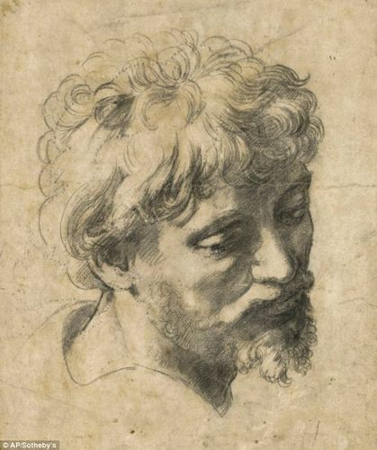

# Drawing Resources

> Links and notes related to drawing.

## Own Thoughts
1. [**_Learning How To Draw_**](1-Learning.md) / tips and general advice
2. [**_Getting Better At Drawing_**](2-Getting-Better.md) / advice for improving and some concerns

## Links
* [**ArtGraphica**](http://www.artgraphica.net/) / free art lessons, books, etc
* [**Charles Bargue Drawing Course**](https://vk.com/doc174101046_174324478?hash=63520daf6ba1f0959b&dl=76664a0100b40bd8e5) / [*plates*](http://www.conceptart.org/forums/showthread.php/166289-Charles-Bargue-Drawings-Prints-to-download)
* [**Perspective Drawing Handbook**](https://issuu.com/beshlaa/docs/perspective_drawing_handbook) / [*issuu*](https://issuu.com/)
* [**Van Gogh Letters**](http://www.webexhibits.org/vangogh/) / [*webexhibits*](http://www.webexhibits.org/)

## Videos
* [**Ways Of Seeing**](https://www.youtube.com/watch?v=0pDE4VX_9Kk) / John Berger

## License

To the extent possible under law, Shane Bowman has waived all copyright and related or neighbouring rights to this work.

