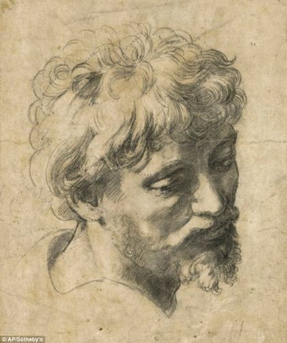

# Drawing Thoughts

> Notes on drawing.

1. *[Learning how to draw](https://github.com/shnbwmn/drawing-thoughts/blob/master/learning-to-draw.md)* - tips and general advice

2. *[Getting better at drawing](https://github.com/shnbwmn/drawing-thoughts/blob/master/getting-better-at-drawing.md)* - advice for improving

## License

To the extent possible under law, Shane Bowman has waived all copyright and related or neighbouring rights to this work.

